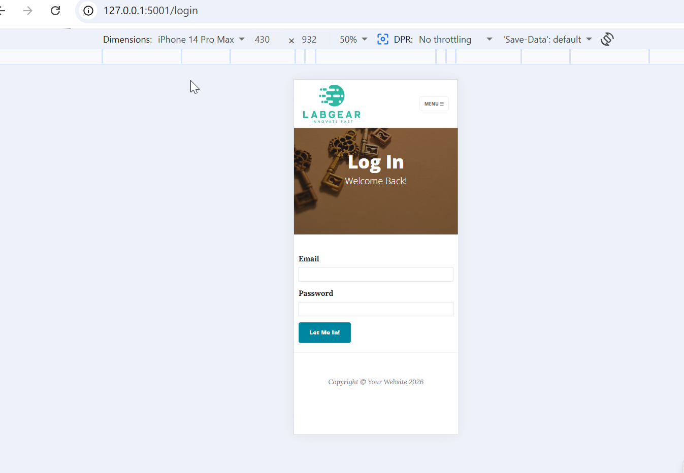
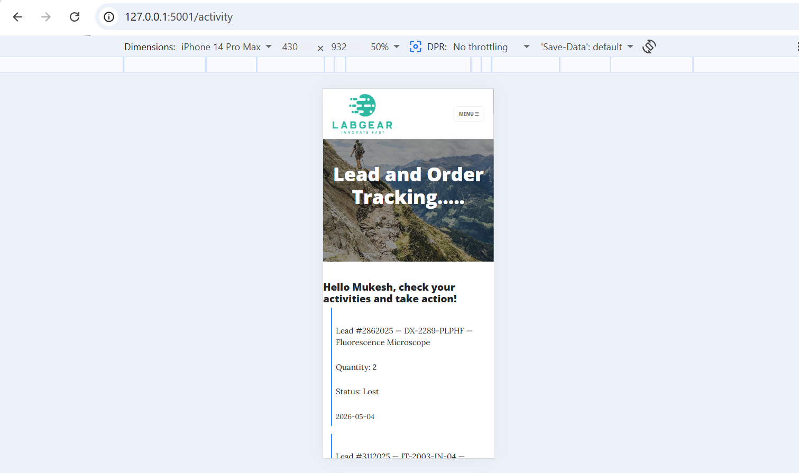
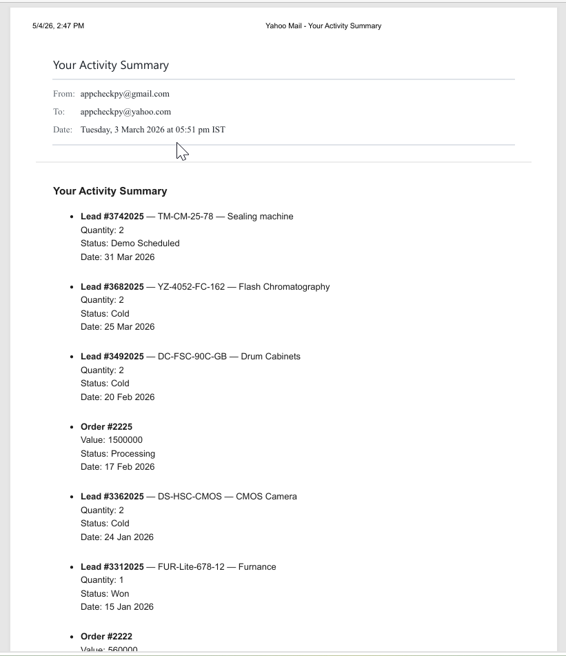

# Enterprise Inventory & Lead Management System

## Project Overview
This full-stack ecosystem is designed to bridge the gap between operational inventory tracking and strategic business intelligence. The project is intentionally structured into three distinct phases to demonstrate a complete transition from raw data collection to predictive decision analytics.

**Phase A:** The Operational Core (Full-Stack Flask)
*   **Purpose:** Establishing the "Single Source of Truth" via a robust inventory and lead management system.
*   **Stack:** Flask, MySQL/SQLite, and Jinja2 templates.

**Phase B:** Executive Visibility (Power BI Suite)
*   **Purpose:** Transforming operational data into high-level business facts for rapid decision-making.
*   **Focus:** KPI tracking, revenue growth, and product performance.

**Phase C:** Decision Analytics & Research (Tableau & Python Stats)
*   **Purpose:** Moving beyond "what happened" to "why it happened" using rigorous statistical methodologies.
*   **Focus:** Risk assessment (CV), demand clustering (Chi-Square), and lead velocity analysis.

📂 Click to expand Project Structure & Architecture

### 🌐 1. Application Layer (Full-Stack Flask)
*   **`main.py`**: The central entry point for the application, handling routing and core logic.
*   **`forms.py`**: Contains WTForms classes for robust data validation.
*   **`templates/`**: Jinja2 HTML templates defining the frontend structure.
*   **`static/`**: Storage for CSS, JavaScript, and UI assets.
*   **`security/`**: Implementation of authentication protocols and access control.
*   **`instance/`**: Dedicated folder for local database files and environment-specific configurations.

### 📊 2. Data Science & Research Layer
*   **`stats_research/`**: Detailed Jupyter Notebooks containing the M.Tech-level statistical analysis (ANOVA, Chi-Square, Bayesian).
*   **`sql_schema/`**: DDL and DML scripts used to build the relational database backend.
*   **`analytics/`**: **The Business Intelligence Hub**. This directory houses the Power BI files, Tableau documentation, and statistical visual assets.

### 🛠️ 3. Infrastructure & Documentation
*   **`design_details/`**: Technical specifications and system architecture documentation.
*   **`media/`**: Repository for images of flask application.
*   **`requirements.txt`**: Complete list of Python dependencies required for the environment.
*   **`.gitignore`**: Configured to protect sensitive instance data and virtual environment files.

---
## Key Features
*   **Inventory Tracking:** Real-time monitoring of stock levels and product details.
*   **Lead Velocity Tracking:** Monitoring the movement of business leads through various sales stages.
*   **Relational Database:** Built with a structured SQLite backend (Phase A) transitioning to MySQL (Phase B).

## Technical Stack
*   **Backend:** Python (Flask)
*   **Database:** SQLite / SQLAlchemy ORM
*   **Frontend:** HTML5, CSS3, Bootstrap 5
*   **Security:** Werkzeug (Security), Flask-Login
*  ### 🔑 Security Utilities
*   **Standalone Hasher:** Developed a dedicated utility script to demonstrate the underlying logic of `Werkzeug` hashing, ensuring a deep understanding of credential security beyond automated libraries.
* ### Database Architecture

* ### Mobile View

### 📺 Application Walkthrough
Click the link below to view the high-definition demonstration of the **Enterprise Inventory Management** system

[![Watch the Demo]](https://youtu.be/6bWFMOgGA6o)

*The walkthrough highlights the integration of Flask, SQLAlchemy, and Bootstrap 5 to deliver a business-ready decision tool.*
### Automated Business Reporting
Below is the automated activity summary generated by the backend, which provides stakeholders with a "sharp" overview of lead health and inventory velocity.
