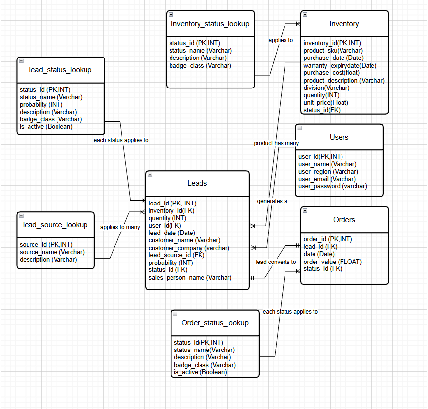

# Enterprise Inventory & Lead Management System

## Project Overview
A full-stack Flask application designed to bridge the gap between operational inventory tracking and strategic lead management. This project represents **Phase A** of a larger transition into decision analytics.

## Key Features
*   **Inventory Tracking:** Real-time monitoring of stock levels and product details.
*   **Lead Velocity Tracking:** Monitoring the movement of business leads through various sales stages.
*   **Relational Database:** Built with a structured SQLite backend (Phase A) transitioning to MySQL (Phase B).

## Technical Stack
*   **Backend:** Python (Flask)
*   **Database:** SQLite / SQLAlchemy ORM
*   **Frontend:** HTML5, CSS3, Bootstrap 5
*   **Security:** Werkzeug (Security), Flask-Login
*  ### 🔑 Security Utilities
*   **Standalone Hasher:** Developed a dedicated utility script to demonstrate the underlying logic of `Werkzeug` hashing, ensuring a deep understanding of credential security beyond automated libraries.
* ### Database Architecture
