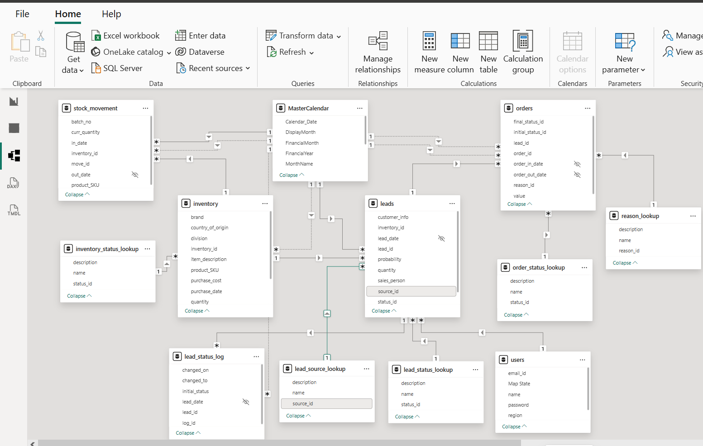
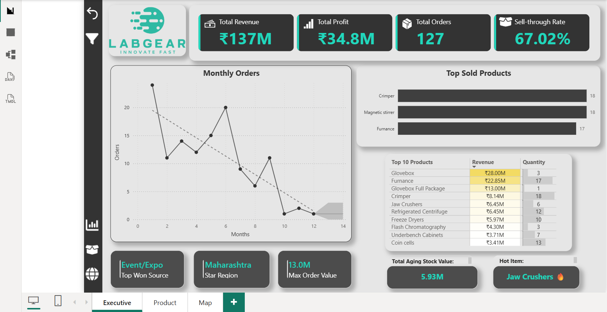
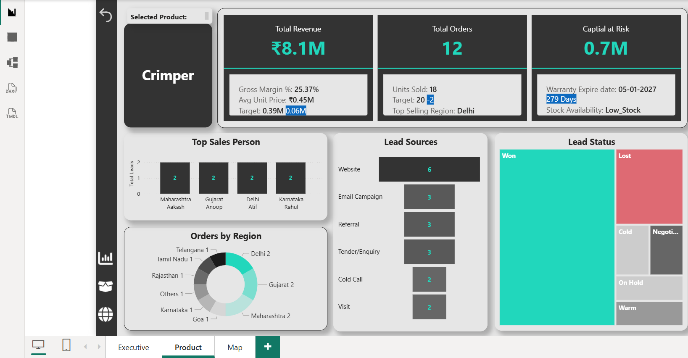
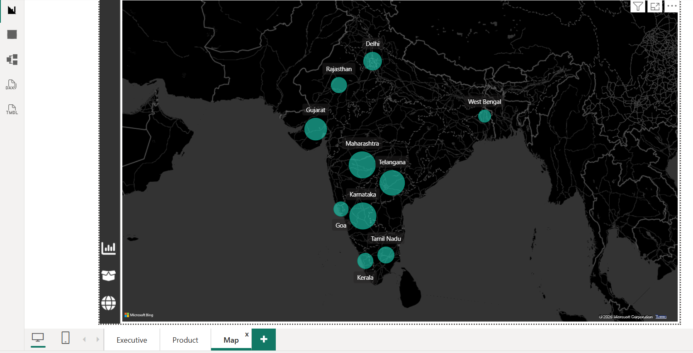
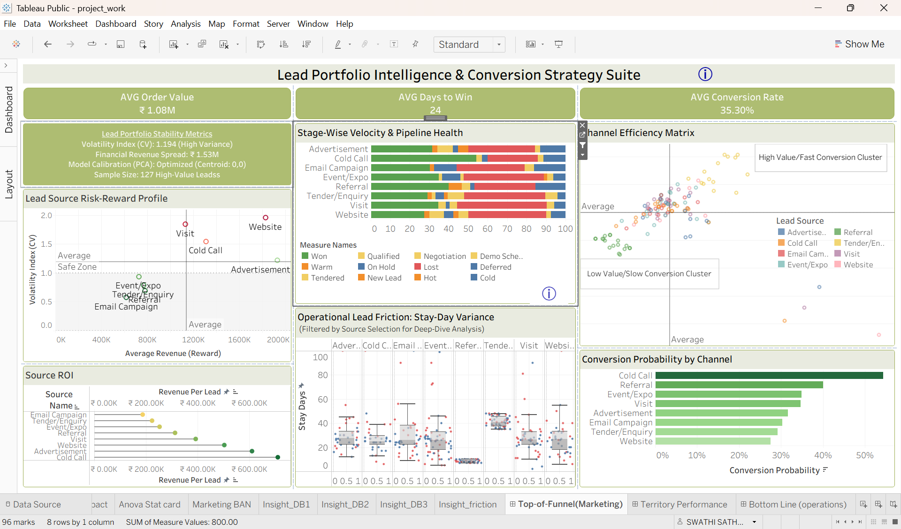
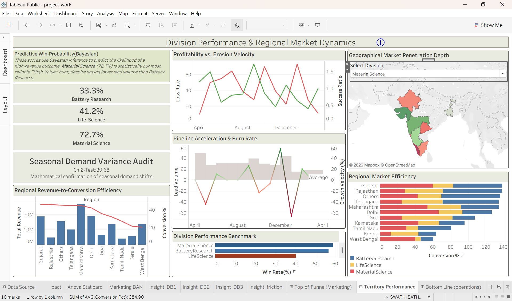
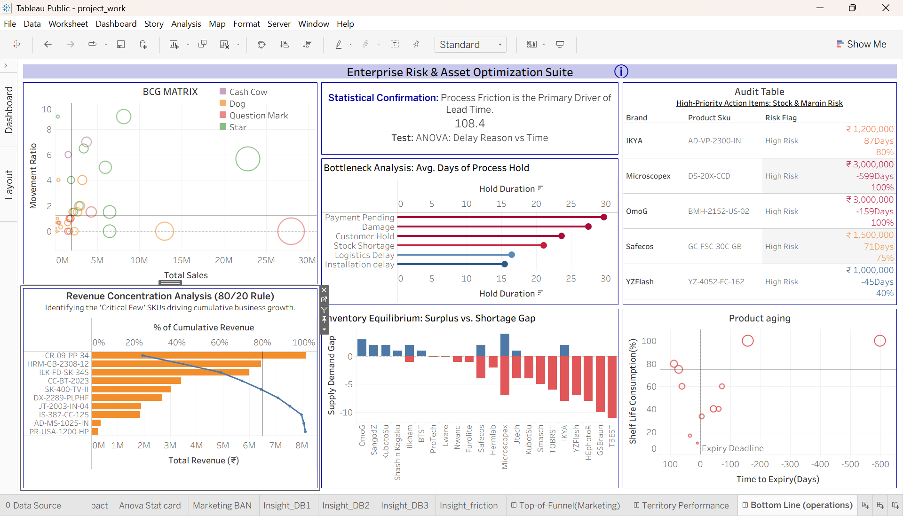

# 📊 Analytics & Visual Intelligence Layer

This directory integrates **Power BI** and **Tableau** to transform Snowflake Schema data into both executive-level business reporting and deep-dive statistical research.

## 🔗 Project Resources
*   **Power BI**: [Interactive Demo Video](https://www.youtube.com/watch?v=MUrf-D1AuWg) | [Download Raw .pbix](labgear.pbix)
*   **Tableau**:  [Interactive Demo Video](https://www.youtube.com/watch?v=G2RpD2M7v5w) | [Interactive Tableau Public Profile](https://public.tableau.com/app/profile/swathi.sathyanarayana3602/vizzes)
    *(Note: Optimized for desktop; please use **Full-Screen mode** for maximum clarity of statistical annotations).*

---

## 🏗️ Technical Architecture
Both platforms are powered by a **Snowflake Schema** backend, connecting directly to specialized SQL views (`friction_analysis`, `bcg_matrix`) to ensure a decoupled, high-performance reporting layer.

### 1. Power BI: Executive Performance & KPI Suite
Focused on high-level operational oversight and historical business facts.
*   **Core Metrics**: Real-time tracking of Revenue, Profit, and Top-Selling Products to monitor overall health.
*   **Lead Performance**: Identifying "Hot Products" and the most successful lead sources for immediate resource allocation.
*   **Model Integrity**: Built on a Fact-Dimension architecture to ensure data consistency across the reporting layer.

**[Power BI Model View]**

**[Power BI Dashboard Overview]**

---

### 2. Tableau: Advanced Statistical Research Layer
This suite represents the **Deep Analytics** phase, translating the statistical research into guided visual narratives.

*   **Marketing & Territory Analysis**: Visualizing **Chi-Square** results to identify non-random demand clusters and seasonal shifts in specific divisions/territories.
*   **Operations & Risk Intelligence**: 
    *   **Coefficient of Variation (CV)**: Quantifying consistency vs. risk across different lead sources.
    *   **Lead Velocity & Friction**: Tracking the speed of movement through the funnel and identifying outliers in the lead logs.
*   **Scientific Validation**: Using **ANOVA** and **Bayesian Win-Probability** to justify long-term strategic shifts in the Material Science Research sectors.

**[Tableau Research Dashboard 1]**

**[Tableau Research Dashboard 2]**

**[Tableau Research Dashboard 3]**

---

## 🛠️ Summary of Tool Selection
| Feature | Power BI | Tableau |
| :--- | :--- | :--- |
| **Primary Audience** | Executive / Operational | Research / Data Science |
| **Logic Layer** | DAX & KPI Facts | SQL Views & Statistical Measures |
| **Key Focus** | "What happened?" (Facts) | "Why did it happen?" (Analytics) |