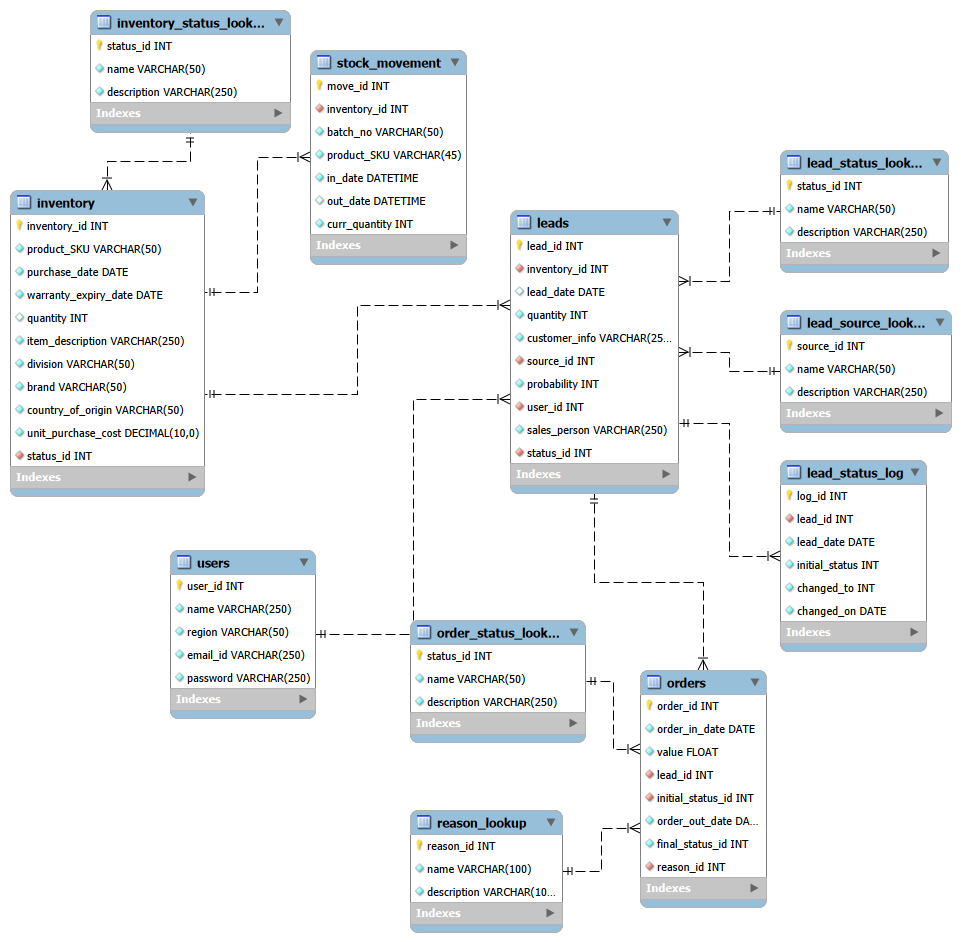

# 🏗️ SQL Architecture & Data Model Evolution

### 🚀 Post-Phase A Evolution
Post-Phase A, I evolved the schema from a strictly transactional (**OLTP**) structure to an analytical (**OLAP**) structure. While the Fact tables remained consistent to preserve data integrity, the Dimension tables were refined to support complex filtering, time-series analysis, and drill-downs in **Power BI** and **Tableau**.

### 📐 The Snowflake Schema (OLAP)
The database is engineered for high-performance Business Intelligence, utilizing a normalized relationship structure to maintain strict data integrity across complex operational workflows:

* **Fact Tables:** `orders` and core transactional logs—preserving the central quantitative business events.
* **Dimension Tables:** `inventory`, `leads`, and `users`—acting as primary descriptive layers.
* **Normalized Lookup Tables (Snowflake Layers):** Extended dimensions like `inventory_status_lookup`, `lead_status_lookup`, and `lead_source_lookup` branch off the primary dimensions to eliminate data redundancy.
* **Log Intelligence:** Includes `lead_status_log` and `stock_movement` for point-in-time velocity, supply chain tracking, and bottleneck analysis.

### 🧠 Analytical Layer: Specialized Views
I developed specialized SQL Views (e.g., `friction_analysis`, `bcg_matrix`) to act as a robust reporting layer. These serve two critical functions:
1.  **Decoupling:** Separates raw transactional data from the reporting layer for cleaner maintenance.
2.  **Pre-calculation:** Embeds complex logic (Conversion Rates, Lead Velocity) directly into the SQL layer to ensure dashboards run at peak speed.

### 🛠️ Multi-Tool Integration
* **Power BI:** Connects directly to the raw, normalized Snowflake Schema tables, leveraging an advanced **DAX Modeling Layer** (including complex iterators, context-shifting, and virtual tables) to compute operational KPIs and inventory valuations on the fly.
* **Tableau:** Leverages centralized, custom SQL Views to perform granular time-series analysis and pipeline funnel visualizations, pre-calculating complex logic at the database level.
* **Python (Jupyter):** Extracts optimized datasets directly from the SQL analytical layer to perform advanced inferential statistics, Bayesian probability analysis, and hypothesis testing.
---

